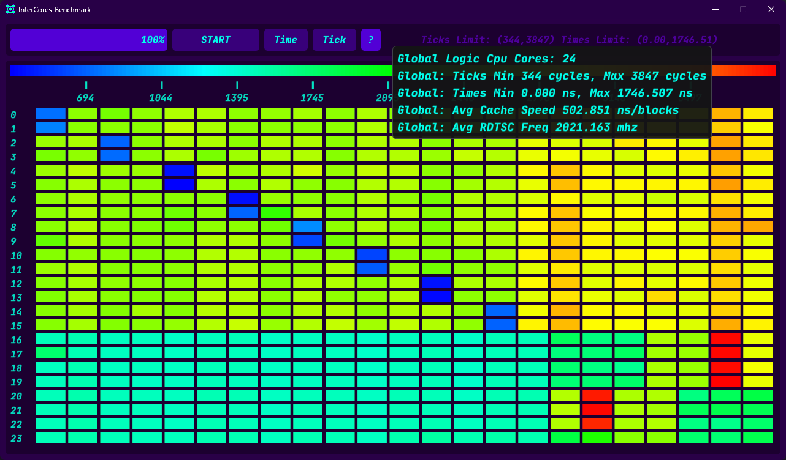
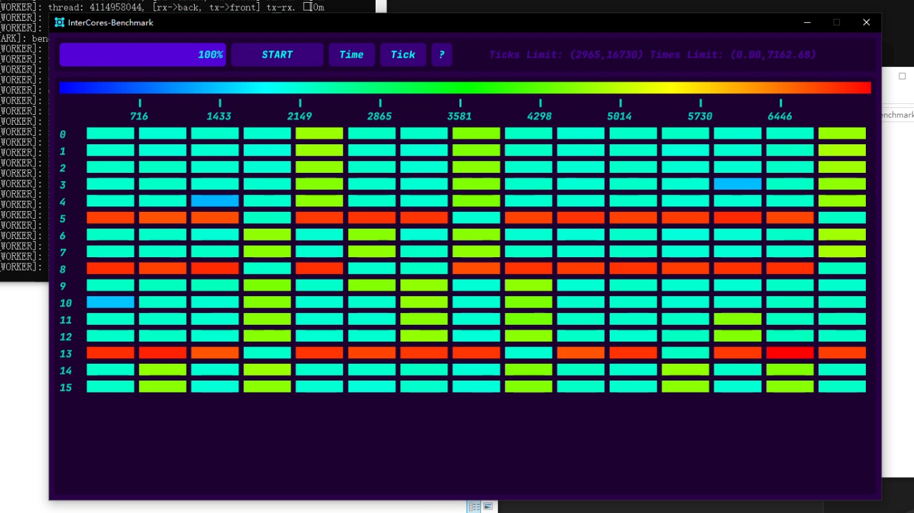

# InterCoresBenchmark

CPU 核心互联延迟基准测试 ( cores interconnection benchmark )

>- Update: 2025.04.19
>- Version: 0.1.1.0419 / 16-32K Release EXE

---

- 目前只使用了 winapi 获取硬件信息, 绑定测试核心读取 RDTSC 等.
- 测试为当前核心 (LogicCore) 与其余核心进行 n 次固定大小 blocks 数据传输. 每个测试线程与核心绑定, 数据统一使用无锁双缓冲进行跨线程拷贝, 采样器只记录拷贝 Ticks 以及时间.
- 互联延迟存在很多因素影响并不是很精准, 数据仅供参考, 并且目前没有封装复杂方法判断超线程, 所以全部按照逻辑核心测试. ( 此项目仅供学习交流 /叠甲 )
- 热度图纵向为每个核心, 横向为每个核心对 CPU 其余核心的数据延迟热度.
- 更多细节阅读: [benchmark_inter](InterCoresBenchmark/InterCoresSystem/system_benchmark/benchmark_inter_cores.h)

<p align="center">
  
  
</p>

> 左图P1: 我自己的笔记本 I7-13700HX 很明显可以看出P核与E核的区分. 
> 右图P2: 某平台虚拟化 16C 很明显如果排除虚拟机调度问题 可以推断为多路跨CPU通信?

---

自定义内部参数 (在源码中搜索定义/变量):
```cpp
BENCHMARK_BLOCK_BYTES // 每个测试拷贝 blocks 大小
BENCHMARK_BLOCK_LINES // block 缓存对齐宽度 bits

TESTING_BLOCKS_GROUP // 单个核心对核心测试的次数 (数据采集后取平均值)
```

---

`END`